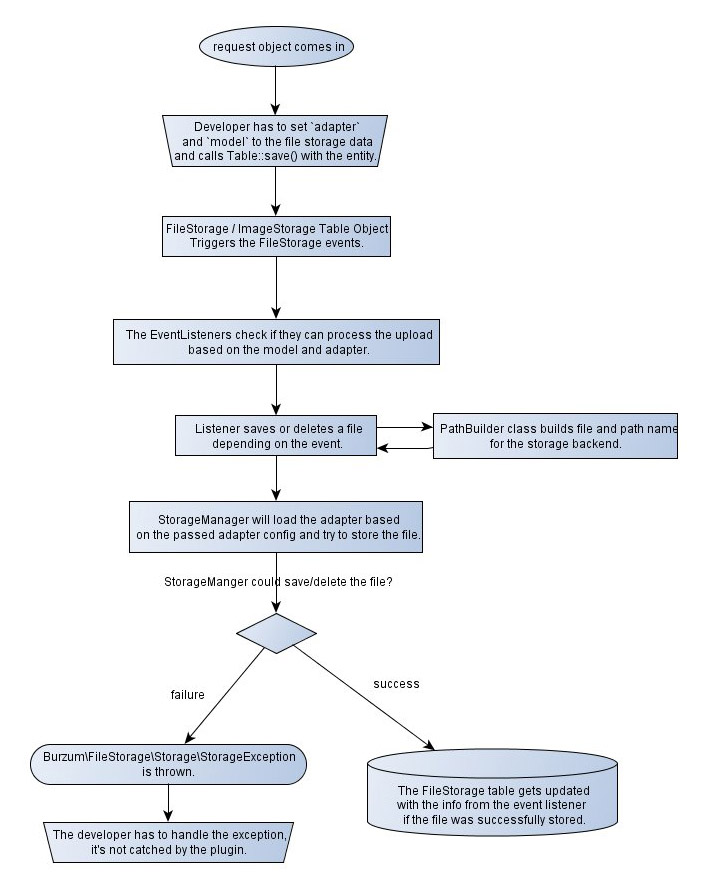

# Overview

The **FileStorage** plugin gives you the ability to upload and store files in
virtually any kind of storage backend. It builds on the
[FlySystem](https://github.com/thephpleague/flysystem) library in a CakePHP
fashion and provides a simple, unified way to use storage adapters.

Storage adapters present a single interface for storing file data to your local
file system, in memory, in a database, in a zip file, or on remote systems such
as Amazon S3 or Azure. A database table keeps track of *what* you stored and
*where*. You can always write your own adapter or extend existing ones.

::: info CakePHP version
This documentation is for the branch that supports **CakePHP 5.1+**. See the
[version map](https://github.com/dereuromark/cakephp-file-storage/wiki#cakephp-version-map)
for older releases.
:::

## How it works

The whole plugin is built with clear
[Separation of Concerns (SoC)](https://en.wikipedia.org/wiki/Separation_of_concerns)
in mind: a file is *always* an entry in the `file_storage` table from the
application's perspective.

The table is the *reference* to the real place where the file is stored, and it
keeps some metadata too — mime type, filename, file hash (optional), and size.

::: warning Don't store paths in arbitrary tables
Storing the path to a file inside an arbitrary table alongside other data is
considered **bad practice** — it doesn't respect SoC from an architecture
perspective. Many people do it anyway; this plugin gives you a cleaner option.
:::

You associate the `file_storage` table with your model using the FileStorage
model from the plugin via `hasOne`, `hasMany`, or `belongsToMany`. When you
upload a file, you save it to the FileStorage model through the associations —
`Documents.file`, for example. The FileStorage model then dispatches
file-storage-specific events; the listeners process the file, put it in the
configured storage backend using the right adapter, and build the storage path
using a path builder class.

## The pieces

| Concept | Responsibility |
|---------|----------------|
| `file_storage` table | The single source of truth — one row per stored file, with metadata. |
| Storage adapter | Where the bytes actually live (Local, S3, Azure, in-memory, …). |
| Path builder | Generates a deterministic storage path from the entity data. |
| FileStorage behavior | Wires upload handling into your table's save/delete lifecycle. |
| Image processor | Generates image variants (thumbnails, crops, alt formats). |

## Next steps

- [Installation](./installation) — install the plugin and set up the database.
- [Quick Start](./quick-start) — add an avatar upload end to end.
- [Usage](./usage) — the core concepts, associations, and upload flow.
- [Serving files](/serving/) — generate URLs and serve files with authorization.
